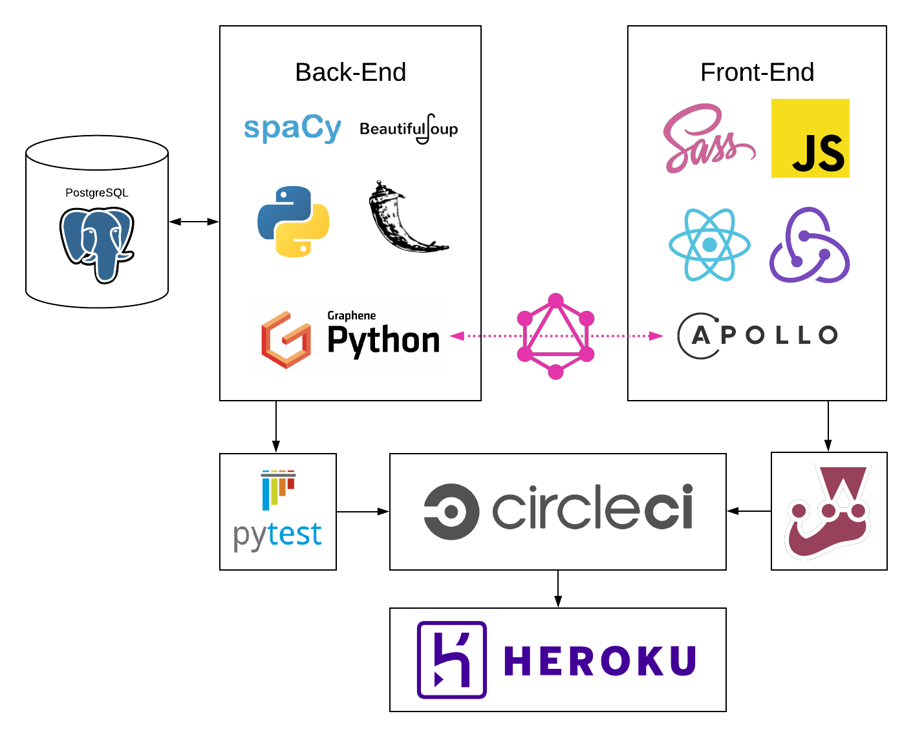

# Rosetta [](https://circleci.com/gh/rosetta-team/rosetta-be) [](https://codeclimate.com/github/rosetta-team/rosetta-be/maintainability)

## Table of Contents

  - [Deployed App](#deployed-app)
  - [Introduction](#introduction)
  - [Repos](#repos)
  - [Dev Team](#dev-team)
  - [Technologies and Frameworks](#technologies-and-frameworks)
  - [Local Deployment](#local-deployment)
    - [Back-End Instructions](#back-end-instructions)
      - [Python and Flask Setup](#python-and-flask-setup)
      - [Database Setup](#postgresql-setup)
      - [Starting Flask Server](#starting-flask-server)
    - [Front-End Instructions](#front-end-setup)
  - [Testing and Test Coverage](#testing-and-test-coverage)
    - [Back-End Testing](#back-end-testing)
    - [Front-End Testing](#front-end-testing)
  - [GraphQL](#graphql)
    - [Schema](#schema)
    - [Queries and Mutations](#queries-and-mutations)

## Deployed App

- Visit the deployed Rosetta app at http://rosetta-fe.herokuapp.com.
- Visit the interactive GraphiQL interface at http://rosetta-server.herokuapp.com/graphql.

## Introduction

Rosetta is Google Translate for programming languages. It eases the process of learning new languages by translating a built-in function in a language you know into the closest equivalent in one you don’t. It does this by scraping official language docs using BeautifulSoup and comparing them using spaCy (a ML-powered natural language processing library) in the Python/Flask back-end, which the React/Redux front-end interacts with using Apollo Client and GraphQL.

## Repos

This is the GitHub repo for Rosetta's back-end Flask micro-service. The repo for the React/Redux front-end can be found at https://github.com/rosetta-team/rosetta-fe.

## Dev Team

Rosetta's dev team is:
- Alison Vermeil ([GitHub](https://github.com/mintona), [LinkedIn](https://www.linkedin.com/in/alison-minton-vermeil/))
- Daniel Frampton ([GitHub](https://github.com/DanielEFrampton), [LinkedIn](https://www.linkedin.com/in/danielframpton/))
- Josh O'Bannon ([GitHub](https://github.com/jobannon), [LinkedIn](https://www.linkedin.com/in/jtobannon/
))
- Matt Simon ([GitHub](https://github.com/msimon42), [LinkedIn](https://www.linkedin.com/in/matt-simon-83aa5380/))
- Veronica Andrade ([GitHub](https://github.com/VeeAndrade), [LinkedIn](https://www.linkedin.com/in/cveronica-andrade/))

## Technologies and Frameworks



- Back-End
  - Language: Python
  - Testing: Pytest
  - Framework: Flask
  - Database: PostgreSQL
  - Database Interaction & ORM: SQLAlchemy
  - Database Migrations: Alembic (via Flask-Migration wrapper)
  - GraphQL Server: Graphene & Flask-GraphQL
  - Web-Scraping: BeautifulSoup
  - Machine Learning & Natural Language Processing: spaCy
- Front-End
  - Language: JavaScript
  - Framework: React/Redux
  - Styling: Sass/SCSS
  - GraphQL Client: Apollo Client
  - Syntax Highlighting: Prism.js
  - Testing: Jest & React Testing Library
- CI/CD
  - Continuous Integration: CircleCI
  - Deployment: Heroku
- Project Management
  - Kanban & Sprint Planning: Github Project Boards
  - Agile Planning & Retros: Miro
  - Communication: Zoom & Slack

## Local Deployment

Both the back-end and front-end of the live Rosetta app are deployed on Heroku, but they can deployed locally by following the instructions below.

### Back-End Instructions

#### Python & Flask Setup

- Clone this repo to your local machine using SSH:
  ```
  git clone git@github.com:rosetta-team/rosetta-be.git
  ```
- Change the working directory to the repo directory:
  ```
  cd rosetta-be
  ```
- Install Pyenv with Homebrew
  ```
  brew install pyenv
  ```
- Add pyenv init to your shell profile (see instructions [here under step 3](https://github.com/pyenv/pyenv#basic-github-checkout))
    - If using Bash, enter the following in your terminal:
        ```
        echo -e 'if command -v pyenv 1>/dev/null 2>&1; then\n  eval "$(pyenv init -)"\nfi' >> ~/.bash_profile
        ```
    - If using Zsh, use the following:
        ```
        echo -e 'if command -v pyenv 1>/dev/null 2>&1; then\n  eval "$(pyenv init -)"\nfi' >> ~/.zshrc
        ```
- Restart terminal to allow changes to take effect.
- Install Python 3.7.7 with Pyenv
    ```
    pyenv install 3.7.7
    ```
- Set up virtual environment
    ```
    python3 -m venv venv
    . venv/bin/activate
    ```
- Upgrade Pip (or, if not made available by Python 3, [install Pip](https://pip.pypa.io/en/stable/installing/#))
    ```
    pip install -U pip
    ```
- Use Pip to install packages in requirements.txt:
    ```
    pip install -r requirements.txt
    ```
- Set environment variables:
    ```
    export FLASK_APP=flaskr/app
    export FLASK_ENV=development
    ```

#### Database Setup

- Install PostgreSQL with Homebrew
    ```
    brew install postgresql
    ```
- Create database from terminal
    - Open interactive PostgreSQL session:
        ```
        psql
        ```
    - Enter SQL command to create empty database:
        ```
        CREATE DATABASE rosetta_dev;
        ```
- Run migrations to add tables to database
    ```
    python flaskr/manage.py db upgrade
    ```
    - If you encounter the error "Target database is not up to date," you are likely out of sync with the migrations. Run `python flaskr/manage.py db stamp head` to set the current state of your database as "head," then re-attempt to run `db upgrade`.
    - If you had to drop your DB in development, you might need to run `python flaskr/manage.py db migrate` before `python flaskr/manage.py db upgrade`.
- If you need to populate your database, read the instructions below, but if possible, it's preferable to import this from an already populated database, such as the Rosetta production server database (to be added):

NOTE: en_core_web_lg doesn't exist as a package in its own right on pypi.org or Anaconda, so you can't just pip install it by name. Instead, you must run the following command:

`python -m spacy download en_core_web_lg`

Afterwards, run the following scripts to populate the database:

   ```
   python flaskr/manage.py get_ruby_array_methods
   python flaskr/manage.py get_js_array_methods
   python flaskr/relevancy_rating_generator.py
   ```

If you need to clear your database, run the following commands:

- Enter the psql console: `psql`
- Connect with Rosetta database: `\c rosetta_dev`
- Clear tables: `TRUNCATE TABLE [table_name] RESTART IDENTITY CASCADE;`

#### Starting Flask Server

- To run server on `localhost:5000`:
  ```
  flask run
  ```
- To run Flask shell session with access to ORM:
  ```
  python flaskr/manage.py shell
  ```

### Front-End Instructions

1. Clone down the front-end repo:
```
git clone git@github.com:rosetta-team/rosetta-fe.git
```
2. Change working directory to repo directory with `cd rosetta-fe`
3. Run `npm install`
4. Run `npm run dev` to get your development server running and compile the application. This will automatically open the website in your browser.
5. After running the server, to manually visit the website navigate to `localhost:3000` in your browser.

### Testing and Test Coverage

#### Back-End Testing

To run back-end test suite:
```
pytest
```

To run test coverage report:
```
coverage report
```

To generate HTML coverage report:
```
coverage html
```

To open generated HTML coverage report:
```
open html-cov/index.html
```

#### Front-End Testing

To run front-end test suite:
```
npm test
```

To run test suite with coverage report:
```
npm test -- --coverage --watchAll
```

After running coverage report, to open graphic interface version:
```
open coverage/lcov-report/index.html
```

### GraphQL

When running the back-end server locally, the interactive GraphiQL interface can be accessed at `localhost:5000/graphql`. There, you can run actual queries and mutations against the back-end and view the automated documentation of the schema and queries.

When sending a query to the server from elsewhere (such as Postman), send a `POST` request to `localhost:5000/graphql` with the query as the body.

#### Schema

This schema is non-exhaustive, and lists only the fields utilized by the front-end. For a complete reference of available GraphQL fields, use the GraphiQL interface and click "Docs" in the top-right corner to access the Documentation Explorer.

| Languages | Data Type | Description |
| ----------- | ----------- | ----------- |
| id | ID! | Primary Key |
| name | String | Name of language |
| methods | [MethodObject] | Associated methods |

| Methods | Data Type | Description |
| ----------- | ----------- | ----------- |
| id | ID! | Primary Key |
| language | LanguageObject | Associated language |
| name | String | Name of method/function |
| description | String | Description of method|
| snippet | String | Example code snippet |
| syntax | Text | Syntax of method usage |
| docsUrl | String | Source URL in official docs |

| MethodResults | Data Type | Description |
| ----------- | ----------- | ----------- |
| id | ID! | Primary Key |
| weightedRelevancyRating | Float | Weighted similarity rating as number btw. 0-1 |
| method | MethodObject | Associated method |

#### Queries and Mutations

##### `translations` Query

Returns top 5 methods or functions in target language as compared to a given method, along with a relevancy rating generated by a machine learning and natural language process library weighted by user input.

- Example Input:
  ```
  {
    translations(targetLanguageId: 2, methodId: 89) {
    	id
    	weightedRelevancyRating
    	method {
    	  id
        name
        description
        syntax
        snippet
        docsUrl
    	}
    }
  }
  ```
- Example Response:
  ```js
    {
     "data": {
       "translations": [
         {
           "id": "7317",
           "weightedRelevancyRating": 0.97647710108909,
           "method": {
             "id": "135",
             "name": "Array.prototype.slice()",
             "description": "The slice() method returns a shallow copy of a portion of an array into a new array object selected from begin to end (end not included) where begin and end represent the index of items in that array. The original array will not be modified.",
             "syntax": "arr.slice([begin[, end]])\n",
             "snippet": "const animals = ['ant', 'bison', 'camel', 'duck', 'elephant'];\n\nconsole.log(animals.slice(2));\n// expected output: Array [\"camel\", \"duck\", \"elephant\"]\n\nconsole.log(animals.slice(2, 4));\n// expected output: Array [\"camel\", \"duck\"]\n\nconsole.log(animals.slice(1, 5));\n// expected output: Array [\"bison\", \"camel\", \"duck\", \"elephant\"]\n",
             "docsUrl": "https://developer.mozilla.org//en-US/docs/Web/JavaScript/Reference/Global_Objects/Array/slice"
           }
         },
         {
           "id": "7301",
           "weightedRelevancyRating": 0.900370010855081,
           "method": {
             "id": "119",
             "name": "Array.prototype.findIndex()",
             "description": "The findIndex() method returns the index of the first element in the array that satisfies the provided testing function. Otherwise, it returns -1, indicating that no element passed the test.",
             "syntax": "arr.findIndex(callback( element[, index[, array]] )[, thisArg])\n",
             "snippet": "const array1 = [5, 12, 8, 130, 44];\n\nconst isLargeNumber = (element) => element > 13;\n\nconsole.log(array1.findIndex(isLargeNumber));\n// expected output: 3\n",
             "docsUrl": "https://developer.mozilla.org//en-US/docs/Web/JavaScript/Reference/Global_Objects/Array/findIndex"
           }
         },
         {
           "id": "7307",
           "weightedRelevancyRating": 0.835100513965771,
           "method": {
             "id": "125",
             "name": "Array.prototype.join()",
             "description": "The join() method creates and returns a new string by concatenating all of the elements in an array (or an array-like object), separated by commas or a specified separator string. If the array has only one item, then that item will be returned without using the separator.",
             "syntax": "arr.join([separator])",
             "snippet": "const elements = ['Fire', 'Air', 'Water'];\n\nconsole.log(elements.join());\n// expected output: \"Fire,Air,Water\"\n\nconsole.log(elements.join(''));\n// expected output: \"FireAirWater\"\n\nconsole.log(elements.join('-'));\n// expected output: \"Fire-Air-Water\"\n",
             "docsUrl": "https://developer.mozilla.org//en-US/docs/Web/JavaScript/Reference/Global_Objects/Array/join"
           }
         },
         {
           "id": "7292",
           "weightedRelevancyRating": 0.834279735840426,
           "method": {
             "id": "111",
             "name": "Array.of()",
             "description": "The Array.of() method creates a new Array instance from a variable number of arguments, regardless of number or type of the arguments.",
             "syntax": "Array.of(element0[, element1[, ...[, elementN]]])",
             "snippet": "Array.of(7);       // [7] \nArray.of(1, 2, 3); // [1, 2, 3]\n\nArray(7);          // array of 7 empty slots\nArray(1, 2, 3);    // [1, 2, 3]\n",
             "docsUrl": "https://developer.mozilla.org//en-US/docs/Web/JavaScript/Reference/Global_Objects/Array/of"
           }
         },
         {
           "id": "7291",
           "weightedRelevancyRating": 0.832082262294994,
           "method": {
             "id": "110",
             "name": "Array.isArray()",
             "description": "The Array.isArray() method determines whether the passed value is an Array.",
             "syntax": "Array.isArray(value)",
             "snippet": "Array.isArray([1, 2, 3]);  // true\nArray.isArray({foo: 123}); // false\nArray.isArray('foobar');   // false\nArray.isArray(undefined);  // false\n",
             "docsUrl": "https://developer.mozilla.org//en-US/docs/Web/JavaScript/Reference/Global_Objects/Array/isArray"
           }
         }
       ]
     }
   }
  ```

##### `allLanguages` Query

Returns all languages in the database and (optionally) their associated methods and their attributes.

- Example Query:
  ```
  {
    allLanguages {
      id
      name
      methods {
    		id
        name
      }
    }
  }
  ```
- Example Response (abridged):
  ```js
  {
  "data": {
    "allLanguages": [
      {
        "id": "1",
        "name": "Ruby",
        "methods": [
          {
            "id": "1",
            "name": "Array::[]"
          },
          {
            "id": "2",
            "name": "Array::new"
          },
          {
            "id": "3",
            "name": "Array::try_convert"
          },
          {
            "id": "4",
            "name": "Array#&"
          },
          {
            "id": "5",
            "name": "Array#*"
          },
          // ...
        ]
      },
      {
        "id": "2",
        "name": "JavaScript",
        "methods": [
          {
            "id": "109",
            "name": "Array.from()"
          },
          {
            "id": "110",
            "name": "Array.isArray()"
          },
          {
            "id": "111",
            "name": "Array.of()"
          },
          {
            "id": "112",
            "name": "Array.prototype.concat()"
          },
          {
            "id": "113",
            "name": "Array.prototype.copyWithin()"
          },
          // ...
        ]
      }
    ]
  }
}
```

##### `createVote` Mutation

Creates a user vote record in the database associated with a particular method result, recalculates that result's user score and the overall weighted relevancy rating, and retrieves an updated top 5 results for the associated search.

- Example Mutation:
 ```
   mutation	{
    createVote(methodResultId: 603, type: "down") {
      id
      weightedRelevancyRating
      method {
        id
        name
        syntax
        snippet
        description
        docsUrl
      }
    }
  }
  ```
- Example Response:
  ```
    {
    "data": {
      "translations": [
        {
          "id": "7317",
          "weightedRelevancyRating": 0.97647710108909,
          "method": {
            "id": "135",
            "name": "Array.prototype.slice()",
            "description": "The slice() method returns a shallow copy of a portion of an array into a new array object selected from begin to end (end not included) where begin and end represent the index of items in that array. The original array will not be modified.",
            "syntax": "arr.slice([begin[, end]])\n",
            "snippet": "const animals = ['ant', 'bison', 'camel', 'duck', 'elephant'];\n\nconsole.log(animals.slice(2));\n// expected output: Array [\"camel\", \"duck\", \"elephant\"]\n\nconsole.log(animals.slice(2, 4));\n// expected output: Array [\"camel\", \"duck\"]\n\nconsole.log(animals.slice(1, 5));\n// expected output: Array [\"bison\", \"camel\", \"duck\", \"elephant\"]\n",
            "docsUrl": "https://developer.mozilla.org//en-US/docs/Web/JavaScript/Reference/Global_Objects/Array/slice"
          }
        },
        {
          "id": "7301",
          "weightedRelevancyRating": 0.900370010855081,
          "method": {
            "id": "119",
            "name": "Array.prototype.findIndex()",
            "description": "The findIndex() method returns the index of the first element in the array that satisfies the provided testing function. Otherwise, it returns -1, indicating that no element passed the test.",
            "syntax": "arr.findIndex(callback( element[, index[, array]] )[, thisArg])\n",
            "snippet": "const array1 = [5, 12, 8, 130, 44];\n\nconst isLargeNumber = (element) => element > 13;\n\nconsole.log(array1.findIndex(isLargeNumber));\n// expected output: 3\n",
            "docsUrl": "https://developer.mozilla.org//en-US/docs/Web/JavaScript/Reference/Global_Objects/Array/findIndex"
          }
        },
        {
          "id": "7307",
          "weightedRelevancyRating": 0.835100513965771,
          "method": {
            "id": "125",
            "name": "Array.prototype.join()",
            "description": "The join() method creates and returns a new string by concatenating all of the elements in an array (or an array-like object), separated by commas or a specified separator string. If the array has only one item, then that item will be returned without using the separator.",
            "syntax": "arr.join([separator])",
            "snippet": "const elements = ['Fire', 'Air', 'Water'];\n\nconsole.log(elements.join());\n// expected output: \"Fire,Air,Water\"\n\nconsole.log(elements.join(''));\n// expected output: \"FireAirWater\"\n\nconsole.log(elements.join('-'));\n// expected output: \"Fire-Air-Water\"\n",
            "docsUrl": "https://developer.mozilla.org//en-US/docs/Web/JavaScript/Reference/Global_Objects/Array/join"
          }
        },
        {
          "id": "7292",
          "weightedRelevancyRating": 0.834279735840426,
          "method": {
            "id": "111",
            "name": "Array.of()",
            "description": "The Array.of() method creates a new Array instance from a variable number of arguments, regardless of number or type of the arguments.",
            "syntax": "Array.of(element0[, element1[, ...[, elementN]]])",
            "snippet": "Array.of(7);       // [7] \nArray.of(1, 2, 3); // [1, 2, 3]\n\nArray(7);          // array of 7 empty slots\nArray(1, 2, 3);    // [1, 2, 3]\n",
            "docsUrl": "https://developer.mozilla.org//en-US/docs/Web/JavaScript/Reference/Global_Objects/Array/of"
          }
        },
        {
          "id": "7291",
          "weightedRelevancyRating": 0.832082262294994,
          "method": {
            "id": "110",
            "name": "Array.isArray()",
            "description": "The Array.isArray() method determines whether the passed value is an Array.",
            "syntax": "Array.isArray(value)",
            "snippet": "Array.isArray([1, 2, 3]);  // true\nArray.isArray({foo: 123}); // false\nArray.isArray('foobar');   // false\nArray.isArray(undefined);  // false\n",
            "docsUrl": "https://developer.mozilla.org//en-US/docs/Web/JavaScript/Reference/Global_Objects/Array/isArray"
          }
        }
      ]
    }
  }
  ```
